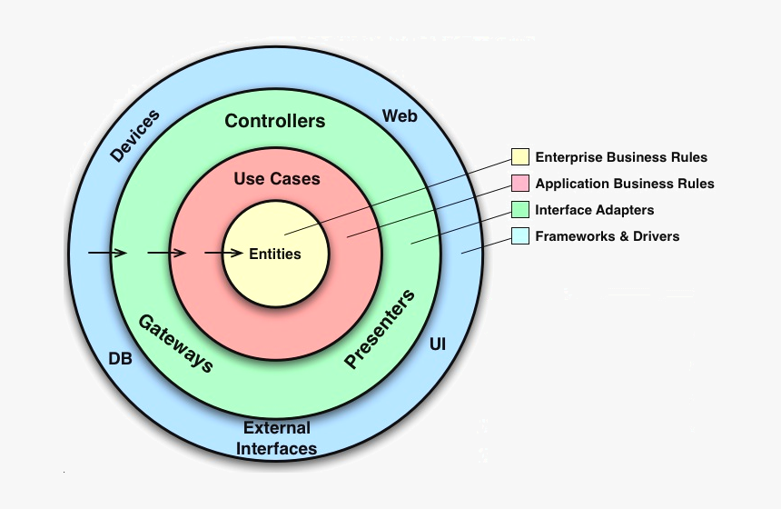

# poc-lambda-producer
poc-lambda-producer
This project aims to validate the sending of data to sqs with golang

## Arquitetura Clean Architecture
Clean Architecture is a software architecture proposed by Uncle Robert Cecil Martin (or Uncle Robert Cecil Martin, as he is better known) that aims to standardize and organize the developed code, promoting its reusability, as well as technology independence.

## Made in golang
Go is a programming language created by Google and released in open source in November 2009. It is a compiled language focused on productivity and concurrent programming, based on work done on the operating system called Inferno.
